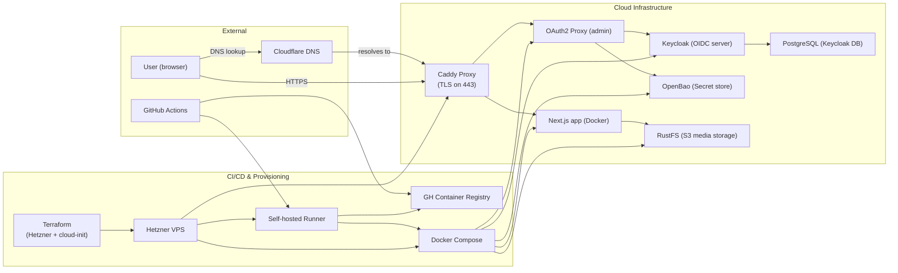

## Getting Started

This repository is a deployment simulation for the Print Farm site. It keeps the website-side stack intact so we can exercise GitHub Actions deployment, CAId-backed secret/bootstrap flow, and Caddy hosting behavior without testing directly against the production portfolio repository.

The application is designed around a few explicit boundaries:

- the public website is served by Next.js
- media is stored in an S3-compatible bucket and referenced through an internal resource registry
- Keycloak is the role authority
- OpenBao is the runtime secret source of truth
- RustFS serves public media and the protected storage/admin surface

## Infrastructure model

The implementation stays MVP-oriented: simple forms, simple tables, server-side auth checks, and a small number of scripts. The website expects a separate central auth/policy deployment to provide Keycloak and OpenBao, while this repo owns the public site, RustFS media path, and the app VPS orchestration.

The current deployment model is:



Operationally, the public website, RustFS media stack, and deployment scripts live here. Keycloak and OpenBao are consumed as upstream infrastructure from the CAId repo.

## Media and auth flow

The media and auth model is intentionally split so that the browser never gets direct write credentials:

1. Editors sign in through Auth.js / NextAuth.
2. The app resolves roles from Keycloak, not from whatever external social provider the user originally used.
3. `/cms/media` calls server routes under `/api/cms/media/*`.
4. Listing and delete operations use the AWS SDK directly against RustFS.
5. Uploads use short-lived presigned PUT URLs so large files do not proxy through Next.js.
6. Public media stays directly readable from the media host and bucket path.

The internal resource registry at `src/lib/resource-schema-data.json` is deliberately not a public page. It is a translation layer that maps logical site resources to object keys so the storage backend can be replaced later without rewriting page code.

## Clone and install

Clone the repo and install dependencies:

```bash
git clone https://github.com/tabeeb09/Print-Farm.git
cd Print-Farm
npm install
```

For simple UI-only local development:

```bash
npm run dev
```

Open `http://localhost:3000`.

## Environment and secrets

This repo supports both a plain local Next.js run and a fuller Docker/OpenBao/RustFS flow.

Copy the base env file first:

```bash
cp .env.example .env
```

or on PowerShell:

```powershell
Copy-Item .env.example .env
```

Fill in the values you actually own, such as:

- domain names / public URLs
- OAuth provider credentials
- OpenBao AppRole bootstrap credentials
- Keycloak client secrets
- S3 credentials
- DNS or VPS provider API tokens, if you are using the infrastructure scripts

For runtime secret fetching, the main script is:

```bash
npm run fetch:openbao-secrets
```

That script reads the configured OpenBao paths and writes the merged runtime material used by the Docker flows.

## Running the stack locally

If you only need the website UI:

```bash
npm run dev
```

If you want the full local stack with generated env assembly:

```bash
npm run prepare:fullstack:local
npm run up:fullstack:local
```

That flow:

- fetches runtime secrets from OpenBao
- generates `.env.full.local.generated`
- starts the local Docker services
- creates the RustFS bucket if missing
- applies bucket CORS/public-read policy
- uploads the registered site resources into RustFS

If you need to run those RustFS preparation steps manually:

```bash
npm run init:rustfs
npm run upload:resources
```

If you want direct Docker Compose control instead:

```bash
docker compose -f docker-compose.rustfs.yaml up -d
docker compose -f docker-compose.app.local.yaml --env-file .env.full.local.generated up -d --build
```

To stop them:

```bash
docker compose -f docker-compose.app.local.yaml --env-file .env.full.local.generated down
docker compose -f docker-compose.rustfs.yaml down
```

To inspect logs:

```bash
docker compose -f docker-compose.app.local.yaml --env-file .env.full.local.generated logs -f
docker compose -f docker-compose.rustfs.yaml logs -f
```

## VPS deployment

This repo assumes:

- OpenBao runs on a separate central auth/policy VPS
- Keycloak runs on that same central auth/policy VPS
- this app VPS fetches runtime secrets from OpenBao using AppRole
- the website image is built by GitHub Actions and pulled from GHCR

The simplest app-hosting flow is:

```bash
sudo apt-get update
sudo apt-get install -y git
git clone https://github.com/tabeeb09/Print-Farm.git /srv/website/app
cd /srv/website/app
sudo bash scripts/setup-app-vps.sh
```

The master operational wrapper is:

```bash
sudo bash scripts/website-stack-vps.sh setup
sudo bash scripts/website-stack-vps.sh deploy
sudo bash scripts/website-stack-vps.sh status
```

What those do:

- `setup`: provisions host dependencies, checks out or updates the repo, prepares base configuration, fetches runtime secrets, deploys RustFS, then deploys the website
- `deploy`: redeploys the RustFS and website stacks and uploads registered resources
- `status`: prints container state

The lower-level scripts remain available if you need to target one part of the flow:

```bash
sudo bash scripts/bootstrap-app-vps.sh
sudo bash scripts/deploy-rustfs-vps.sh
sudo bash scripts/deploy-app-vps.sh
```

`bootstrap-app-vps.sh` is the step that prompts for or reads:

- `BAO_ADDR`
- `OPENBAO_ROLE_ID`
- `OPENBAO_SECRET_ID`

It then fetches secrets from OpenBao, writes the deploy env files under `/etc/website`, and prepares the stack for Compose deployment.

## Hetzner bootstrap

If you are using the Hetzner bootstrap path, first create a config file from the example:

```powershell
Copy-Item .\infra\hetzner-single\bootstrap.config.example.json .\my-bootstrap.config.json
```

Then fill in your own values and run:

```powershell
.\scripts\bootstrap-hetzner-project.ps1 --config .\my-bootstrap.config.json
```

This path expects your own:

- Hetzner API token
- Cloudflare API token, if DNS automation is enabled
- GitHub token for runner/repo configuration
- domain names
- external OAuth credentials

If the Google OAuth values come from a downloaded Google client JSON, use the dedicated script option rather than hand-copying:

```powershell
# TODO: replace with your actual local path
.\scripts\bootstrap-hetzner-project.ps1 --config .\my-bootstrap.config.json -GoogleClientSecretsFile C:\path\to\client_secret.json
```

## Admin access

After startup, the main endpoints are:

- website: `https://<APP_HOST>`
- CMS: `https://<APP_HOST>/cms/media`
- media endpoint: `https://<MEDIA_HOST>`
- RustFS admin surface: `https://<RUSTFS_ADMIN_HOST>`
- OAuth2 Proxy callback/auth host: `https://<OAUTH2_PROXY_HOST>`

The website repo does not bootstrap Keycloak or OpenBao itself. Those are expected to come from the separate CAId deployment.

## Resource registry and media updates

Static assets and paper files are registered in:

```text
src/lib/resource-schema-data.json
```

That file is the internal translation layer for future storage migrations. It is where logical resource IDs map to object keys and local source paths.

To upload all registered assets and paper bundles into RustFS/S3:

```bash
npm run upload:resources
```

If you add a new asset or report:

1. place it in the repo
2. register it in `src/lib/resource-schema-data.json`
3. rerun `npm run upload:resources` or a normal VPS deploy

## GitHub Actions deployment

The deployment workflow is:

```mermaid
graph LR
  Dev["Developer Machine"]
  Repo["Git Repository"]
  Clone["Run `git clone`"]
  Env["Copy/edit `.env` file"]
  Secrets["Fill secrets (DOMAIN, API tokens, etc.)"]
  Push["Push to `main`"]
  CI["GitHub Actions CI"]
  Build["Build & publish Docker image to GHCR"]
  Runner["Self-hosted Runner (on VPS)"]
  Deploy["`docker compose up -d`"]
  Stack["Running stack on VPS"]
  Browser["Access via browser (e.g. ${DOMAIN})"]

  Dev --> Repo
  Repo --> Clone
  Clone --> Env
  Env --> Secrets
  Secrets --> Push
  Push --> CI
  CI --> Build
  Build --> Runner
  Runner --> Deploy
  Deploy --> Stack
  Stack --> Browser
```



In practice, automatic deploys from the website workflow restart only the website app stack. They do not need to restart RustFS unless you explicitly request a broader deploy scope.

Required repository secrets are:

```text
DEPLOY_HOST
DEPLOY_USER
DEPLOY_SSH_PRIVATE_KEY or DEPLOY_SSH_PRIVATE_KEY_B64
DEPLOY_SSH_KNOWN_HOSTS or DEPLOY_SSH_KNOWN_HOSTS_B64
```

Optional repository variables:

```text
DEPLOY_PORT=22
USE_LOCAL_RUSTFS_NETWORK=true
APP_EXTRA_COMPOSE_FILES=
RUSTFS_EXTRA_COMPOSE_FILES=
```

To prepare the SSH deploy material from a local machine:

```powershell
.\scripts\prepare-github-actions-vps-deploy.ps1 -HostName your-vps-hostname -UserName deploy -InstallPublicKey
```

For a non-standard SSH port:

```powershell
.\scripts\prepare-github-actions-vps-deploy.ps1 -HostName your-vps-hostname -UserName deploy -Port 2222 -InstallPublicKey
```

## Local checks

The repo currently supports:

```bash
npm run build
npm run lint
```
